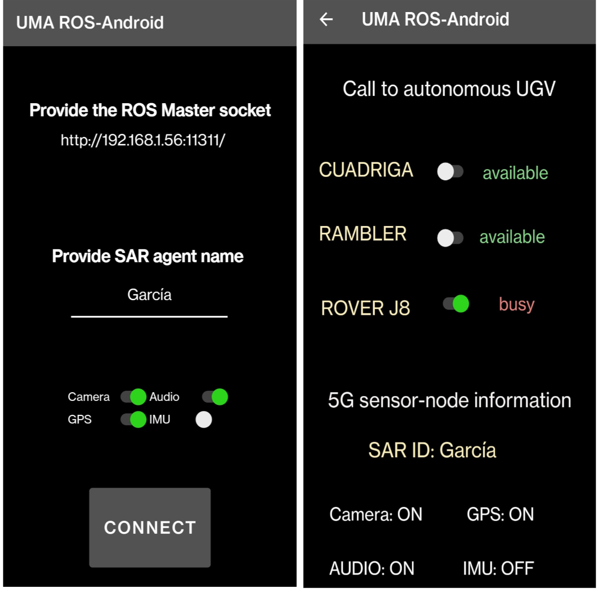
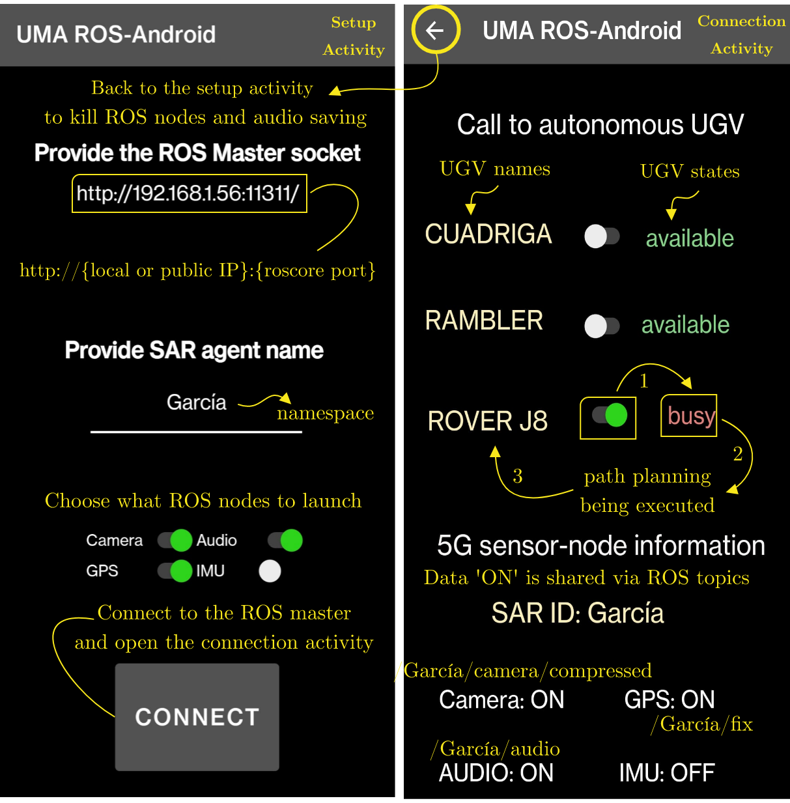

# UMA-ROS-Android
**Note: The references can be seen at the end of the user case**

This app makes a smartphone able to publish data from its sensors to
other devices via ROS1 for monitoring purposes or to apply analysis algorithms based on Edge/Cloud Computing methods.

The target version of the app is Android 10 (properly tested), but should be compatible with versions greater than 5.0.

Current supported sensors are:
- Camera (using cameraX)
- Microphone (using AudioRecord)
- GPS (LocationManager)
- IMU (SensorManager)

The code of two latter are based in a previous solution called [android_sensors_driver](https://github.com/ros-android/android_sensors_driver),  
slightly modified for integration with the rest of the app.

Audio captured is published and also saved as a WAV file in the internal storage for offline analysis.

## Installation
The installation is made through Android Studio IDE. Since rosjava supports Gradle and Maven repositories, there's no
need for downloading any other dependencies manually. Everything will be automatically installed once you open and build the project
in Android Studio (Shift+F9).

To install the app, make sure that the desired SDK version is installed and run the app (Shift+F10), which will install it in your device.

## A real use case: cooperation between search and rescue agents

We present the design (frontend) and functionality (backend) of the developed UMA-ROS-Android app, being executable in current Android version
(API 32). The app is intended for general use in distributed robotic systems, based on the Cloud Robotics concept. 
The main goal is to integrate a smartphone as a sensor-node, by publishing information, via ROS, from and about the search and rescue (SAR) agent carrying it. Next figure shows the smartphone running the app UMA-ROS-Android being used by different kinds of SAR agents (human, UGV and UAV).

 <p align="center">
    
<p/>

The interaction between the SAR agent and the UMA-ROS-Android app must be user-friendly and agile, leading to a double purpose: 
 1) To expand the ROS network, adding new sensor-nodes to the internet of robotics things (IoRT) ecosystem, either through a local area network (LAN) or via the wide area network (WAN), by means of smartphones. 
 These devices are interesting for an IoRT because they have their own mobile connectivity (no dependence on routers), high processing power
 in a small container, internal memory large enough to store datasets, and attractive sensors for data collection: cameras, IMU, GPS and a microphone.
 For this, the user must set the socket local to his network or public, so that the connections will be local to the smartphone's network, or remote to it, respectively.
 
 2) To address some needs of human and robotic SAR agents, acquiring information from their surroundings: images and audio, especially. 
 In addition, the app should encourage cooperation between agents: activate a path-planning for a UGV towards the location of the responder
 using the app in his/her smartphone. Moreover, it is necessary to get and show information from other agents in the screen.
  
 The app has two screens as a user interface.
 
 ## Both activities (setup and connection to the ROS network)
 
The configuration screen to connect to the ROS network is based in the [default Master Chooser](https://github.com/rosjava/android_core/blob/kinetic/android_core_components/src/org/ros/android/MasterChooser.java) provided with rosjava. This version is a modified one where the commonly not used configuration parameters were scraped. Instead, now there are:

- A text entry for the IP address (local or public) and the LAN or WAN port of the ROS master to which the smartphone will connect 
- A text entry where the phone identifier is defined; 
- A series of switches to determine which sensory information is to be sent; 
- A button to start the connection.

This makes the execution of the app in multiple smartphones simultaneously in the same ROS network possible.

Once the connection with the ROS Master is established the Main Activity ("ConnectActivity") is executed, where all the nodes checked with the switches run and publish the data.

<p align="center">
    
<p/>

<p align="center">
    
<p/>

Topics in this case:
```
/García/camera/compressed
/García/camera/camera_info
/García/audio
/García/fix
/García/IMU
/García/calling_to_RoverJ8
```

Previous versions of the app showed a preview view of the camera in the Main Activity GUI but, due to battery consumption issues, it is currently removed. If needed it can be easily reimplemented thanks to cameraX.

A dark, high contrast colour gamut has been chosen for
 proper outdoor viewing and so that devices with OLED displays can benefit from reduced battery consumption. When UMA-ROS-Android is executed 
 in a smartphone, the first activity running is the setup activity. In here, two user inputs are requested: the ROS master socket 
 (local or public IP address and port) in order to connect to the ROS nodes distributed over an SAR-IoCA architecture, and the user identification. 
 This user name is associated with the namespace of the ROS topics where the desired information will be published. This can be done by marking 
 the switches related to each of the smartphone's internal sensors (camera, microphone, IMU and GPS). When these switches are enabled,
 their colour changes to green. Finally, a large button has been set up for the user to connect to the ROS network distributed in the Fog. 
 Therefore, all these topics are visible in any host of the architecture: Cloud, MECs and IoRT.
 
 The second screen is the connection activity, where the user can select one or more switches in order to call one or more of the robots (UGVs) 
 available in the IoRT. The list of UGVs presented in this new version of the app is static, and includes three UGVs from the 
 Robotics and Mechatronics Group of the University of Malaga (Spain): Cuadriga, Rambler and Rover J8. All of them can be called from the app, thanks to the integration of a feedback information system (FIS) in the ROS network. Figure shows how the agent García has performed a query for the Rover J8 to be planned to the location of the smartphone, which is taken by SAR-FIS in the ROS topic /García/fix. Finally, the bottom of the connection activity shows 
 what information is transmitted from this smartphone and through which ROS topics.
 
 The functionality of the application is structured in 10 classes written in java, eight of which include the construction of the ROS nodes needed to exchange information with the rest of ROS nodes in the SAR-IoCA architecture. The other two java classes are associated with the two activities that make up the frontend, so that the user can switch from one to the other using objects.

### In the case of the setup activity:

**CustomMasterChooser**: links the switches on the setup activity to ROS publishers, allowing the user to choose which information to transmit.
**CameraNode**: an object for image analysis is instantiated by defining the target resolution and the camera that will provide the image (1080p resolution and rear camera are selected by default). Then, the node enters a listening routine where each incoming frame from the camera in YUV format is converted and compressed to JPG format and packed into a ROS message to be published as {sensor_msgs/CompressedImage}. The image was shown on the screen in early versions of the app, but given the high energy consumption of the smartphone, it has been decided to hide this option. Each time a frame is published, it is accompanied by a message with information about the image resolution in another topic. If the smartphone camera is calibrated, the resulting matrices can also be included.

**AudioNode**: allows the transmission of the sound captured from the environment for remote monitoring and processing. Saving the audio recorded in the phone's storage is also possible and is useful for offline processing or to create datasets from experiments. The AudioRecord library has been used to access the microphone. Like cameraX, this library opens a continuous buffer with the sensor readings. Initially, the {AudioRecord} instantiation is configured to capture stereo audio at a sampling rate of 44. kHz and 16-bit encoding. After this, it enters a loop that ends when the application is closed. It reads the microphone data in the form of a vector of {uint8}, writes this reading to a temporary file, packs it into a message of type {std_msgs/UInt8MultiArray} and publishes it. 
When the app disconnects from the master node, the temporary file is converted into an audio file in waveform format ({.WAV}). %To do this, an auxiliary routine is run which specifies the audio sampling parameters in the file header and then rewrites the contents of the temporary file into the final audio file, stored in a specific folder on the smartphone. The file name contains the phone identifier and the recording start date and time.

**GPSNode and ImuNode**: A listening routine reads the data from the sensors, and other auxiliary routines package them into ROS messages and publish them. The IMU sends orientation, angular velocity and linear acceleration data. This information is published to the ROS network as {/sensor_msgs/IMU}, according to the default sampling rate.

For GPS, the native Android location library is used and the readings are sent in a ROS message of type {sensor_msgs/NavSatFix}. 
There are two GPS configuration parameters: the minimum time (in milliseconds) and minimum distance (in meters) between two consecutive updates of the GPS location. By default, these parameters take a null value, which means they are continuously updated.
By default they have been given a null value updated.

### In the case of the connection activity:

**ConnectActivity**: shows what information is being published and links the SAR ID to the namespace established in the first screen.
This class manages all the ROS nodes related to the path-planning activation and shows the status of the UGVs
The back button kills all existing ROS nodes on the smartphone and stores the audio file in the internal memory of the device.

**CuadrigaNode**, **RamblerNode** and **RoverJ8Node**: ROS nodes publishing a Bool message associated with the user's selection of a robot. 
This message is used to trigger path planning from SAR-FIS for the needed available UGV. 
The sending frequency is set by default to 500 ms. 
Each switch belonging to a UGV has its own ROS topic, where the namespace identifies the human agent requesting the autonomous movement of the UGVs,
followed by the name {calling_to_robot}, where {robot} is the name of the UGV.

**statusNode**: ROS node subscribed to a topic generated by SAR-FIS, where the published message is related to the availability of each UGV in the IoRT. 
In case a UGV is available (not being used by another agent or called by another smartphone), the display (in the connection activity) will show its status: available or busy.

### Integration in the ROS network

For this particular use case, next figure shows the ROS nodes distributed through the Fog, including the generated by the app. 

The most relevant ROS nodes for the case study presented in here are summarized in the following. 
#### In the IoRT:

 **ntrip_ros** gets the stream of the differential corrections and publishes it in the {RTCM} topic.

 **gps0** and **gps1** are the driver nodes that publish the position in the {gpsx/fix} topic, and the orientation in  {gps1/ori}. Differential corrections are obtained trhough the RTCM topic.
    
**center_gps** publishes the centered GPS position in gpsj8/fix.
    
 **obj_fixer** reads the list of the GPS objectives gps_objs and publishes the current objective in cur_obj.
    
**joystick_driver** publishes in ROS {joy} the joystick's input to be able to teleoperate the robot or change to the path-following mode.
    
**control_loop** is the main control node. In path-following it uses the current vehicle position gps/fix, orientation \textit{gps1/ori} and GPS objective cur_obj to perform a carrot-chasing algorithm. In teleoperation mode it uses the joystick commands and translates them to velocity commands. In both modes, velocity commands are published in cmd_vel.
    
**camera_driver** publishes both cameras rear_camera and front_camera), providing together a 360 degree vision of the robot's surrounding.
 
**lidar_driver** is the Velodyne VLP16 driver, which publishes the lidar_packets messages to be then processed into point clouds in the MECs.
    
**padsim_arduino** subscribes to the velocity commands topic cmd_vel and  emulates an Xbox controller using Xinput.
    
**smartphone** node is running inside the smartphone and publishes the data of its GPS in namespace/fix, camera in namespace/camera/compressed and audio in namespace/audio. It is possible as well to communicate with the ROS node SAR-FIS to request the support of a UGV using the topic call_to_robot.
 
 #### In the MECs, the nodes are implemented as follows:
 
**joystick_driver** reads the inputs from the joystick and publishes them in {joy}, allowing an operator at the MECs to remotely teleoperate the UGV.
     
**lidar_processing** subscribes to the {lidar_packets} published by the robot and processes them into a point cloud ({lidar/pointCloud}).
     
**images360_monitoring**, **images_sm_monitoring** and **lidar_monitoring** are used to visualize the robot's cameras, smartphone camera and lidar respectively. 

**SAR-FIS** runs in MATLAB, making it possible to monitor the agents' GPS positions (through gps_j8/fix and namespace/fix), and generate a list of waypoints or objectives for a UGV publishing it in gps/objs.  

Finally, the an implementation of the SAR-IoCA architecture has been implemented. The extraction route finishes at the medical post,
where victims were attended and finally transported by an ambulance to the helicopter evacuation area. The robot responded to the call made by the rescuer from the smartphone **using the UMA-ROS-Android app**.


## References: some papers related to UMA-ROS-Android

**[1] The Internet of Cooperative Agents Architecture (X-IoCA) for Robots, Hybrid Sensor Networks, and MEC Centers in Complex Environments: A Search and Rescue Case Study**

@article{bravo2021internet,
  title={The Internet of Cooperative Agents Architecture (X-IoCA) for Robots, Hybrid Sensor Networks, and MEC Centers in Complex Environments: A Search and Rescue Case Study},
  author={Bravo-Arrabal, Juan and Toscano-Moreno, Manuel and Fernandez-Lozano, JJ and Mandow, Anthony and Gomez-Ruiz, Jose Antonio and Garc{\'\i}a-Cerezo, Alfonso},
  journal={Sensors},
  volume={21},
  number={23},
  pages={7843},
  year={2021},
  publisher={MDPI}
}

**[2] Integración de smartphones 5G en redes de sensores distribuidas para robótica de exteriores mediante ROS y Android**

@inproceedings{ruizmudarra2022app,
  title={Integración de smartphones {5G} en redes de sensores distribuidas para robótica de exteriores mediante {ROS} y {A}ndroid},
  author={Ruiz Mudarra, G. and Bravo-Arrabal, J. and Fern{\'a}ndez-Lozano  J. J. and  Garc{\'\i}a-Cerezo, A.},
  booktitle={Jornadas de Robótica, Educación y Biongeniería del Comité Español de Automática},
  year={2022},
  pages={91--99}
}

**[3] Remote planning and operation of a UGV through ROS and commercial mobile networks**

@inproceedings{sanchez2022remoteplan,
  title={Remote planning and operation of a {UGV} through {ROS} and commercial mobile networks},
  author={Manuel Sánchez-Montero and Manuel Toscano-Moreno and Juan Bravo-Arrabal and Javier Serón Barba and Pablo Vera-Ortega  and Ricardo Vázquez-Martín and  J.J. Fernandez-Lozano and
 Anthony Mandow and Alfonso García-Cerezo},
  booktitle={Fifth Iberian Robotics Conference},
  year={2022},
  pages={Submitted to}
}

**[4] Integrating ROS and Android for Rescuers in a Cloud Robotics Architecture: Application to Casualty Evacuation Exercise**

@inproceedings{toscano2022sarfis,
  title={Remote planning and operation of a {UGV} through {ROS} and commercial mobile networks},
  author={Manuel Toscano-Moreno and Juan Bravo-Arrabal and Manuel Sánchez-Montero and Javier Serón Barba and Ricardo Vázquez-Martín and  J.J. Fernandez-Lozano and Anthony Mandow and Alfonso García-Cerezo},
  booktitle={IEEE International Symposium on Safety, Security, and Rescue Robotics (SSRR)},
  year={2022},
  pages={Submitted to}
}

## How to add more nodes

### Add a switch in the GUI

The procedure to add a new node is relatively simple and replicable. This step should be done if you want to decide from the interface which nodes are executed. **However, in case you only want the node to be executed indefinitely, skip this section**

First, if you want to be able to choose from the GUI whether to activate the node, you must include a new switch in the configuration screen ("SetupActivity") to do so:
- Go to project folder `<desired directory>/uma-ros-android/app/src/main/res/layout`. Here are the two interface files for the two activities included in the app. Open `activity_setup.xml`
- Locate the _container_ where all the switches are located and add a new one. It is recommended to copy one of the included ones and modify it to place it wherever you want (_Android Studio_ allows a preview to check that the interface is correct). For example:

```xml
<Switch
    android:id="@+id/NewSwitch"
    android:layout_width="100dp"
    android:layout_height="wrap_content"
    android:text="New"
    app:layout_constraintEnd_toEndOf="parent"
    app:layout_constraintStart_toEndOf="@+id/NLPSwitch"
    app:layout_constraintTop_toTopOf="parent"
    tools:ignore="UseSwitchCompatOrMaterialXml"
    android:textColor="@color/colorText" />
```

Next thing to do is to change the source code of the activities to know the state of the new switch:

- Go to the folder `.../app/src/main/java/com/example/umarosandroid`. In this folder is the source code for the two activities and the sensory management ROS nodes.

- Open the file `CustomMasterChooser.java`.

- Create a new variable called (following the previous example) `newSwitch` of type `Switch` and associate it to the switch defined in the _layout_. Also declare a `boolean` variable where the state of the switch will be store and a string for the transfer of variables between activities:

```java
public static final String ENABLE_NEW = "com.example.umarosandroid.ENABLE_NEW";
Switch newSwitch;
boolean enableNew;

newSwitch = (Switch) findViewById(R.id.NewSwitch);
```

- Add a new listener routine for the state of the new `Switch`:
```java
newSwitch.setOnCheckedChangeListener(new CompoundButton.OnCheckedChangeListener() {
@Override
public void onCheckedChanged(CompoundButton buttonView, boolean isChecked) {
enableNew = isChecked;
}
});
```

- Find the "Connect" button's listener routine and look for the conditional `if(result)`, which is true when a connection has been established with the ROS master. Add inside the following line, which will pass the state of the `Switch` (off or on) to the main activity to execute (or not) the corresponding node.
```java
mIntent.putExtra(ENABLE_NEW,enableNew);
```

The next step would be to modify the activity to launch the corresponding node based on the state of the switch when the button was pressed:
- Open the file `MainActivity.java`.

- Declare a variable of type `boolean` where the state of the switch is stored (in this activity), as well as its reception management from the configuration activity:

```java
boolean enableNew;
enableNew = intent.getBooleanExtra(CustomMasterChooser.ENABLE_NEW,false);
```

- Add in the execution routine `init(NodeMainExecutor nodeMainExecutor)` a conditional from the boolean variable for node execution.

```java
if(enableNew) {
    NewNode newNode = new NewNode(nodeName);
    nodeMainExecutor.execute(newNode, nodeConfiguration);
}
```

### No switch in the GUI 

In case the node doesn't need a switch, just:

- Open the file `MainActivity.java`.

- Add in the execution routine `init(NodeMainExecutor nodeMainExecutor)` the following lines:

```java
NewNode newNode = new NewNode(nodeName);
nodeMainExecutor.execute(newNode, nodeConfiguration);
```

### Define the node
Once the app is ready to execute the new ROS node, the last thing to do would be to write its source code.

- Create a `NewNode.java` class file

- Nodes in this application that are not based on the *android_sensors_driver* application (those created from scratch) follow the basic structure of [rosjava documentation](http://rosjava.github.io/rosjava_core/0.1.6/getting_started.html). That is, for example:

```java
public class NewNode extends AbstractNodeMain {
    private String nodeName;
    private Publisher<String> newPubliser;
    public NewNode(String nodeName) {
        this.nodeName = nodeName;
    }
    @Override
    public GraphName getDefaultNodeName() {
        return GraphName.of(nodeName+"/NewNode");
    }
    @Override
    public void onStart(ConnectedNode connectedNode) {
        newPubliser = connectedNode.newPublisher(nodeName+"/NewTopic",String._TYPE);
        String newMsg = newPubliser.newMessage();
        connectedNode.executeCancellableLoop(new CancellableLoop() {
            // Routine executed before
            // entering the main loop
            @Override
            protected void setup() {
                newMsg.setData("Hello World!");
            }
            // Main loop
            @Override
            protected void loop() throws InterruptedException {
                newPublisher.publish(newMsg);
                Thread.sleep(1000);
            }
        });
    }
}
```
- Note that it is also necessary to add the libraries, instances and other elements required for the new sensors or functionalities to be included, which are the responsibility of the reader to find the necessary documentation.

Finally, when the changes are loaded into the app, a ROS node called `<identifier>/NewNode` will be launched, this node will publish in the topic `/identifier/NewTopic` every second a message saying `"Hello World!"`. From this base structure we have created the rest of the more complex nodes such as the camera and audio nodes.
