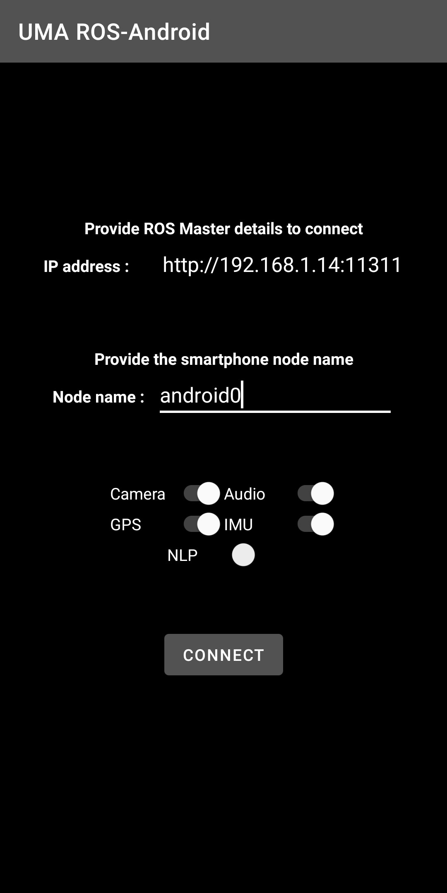
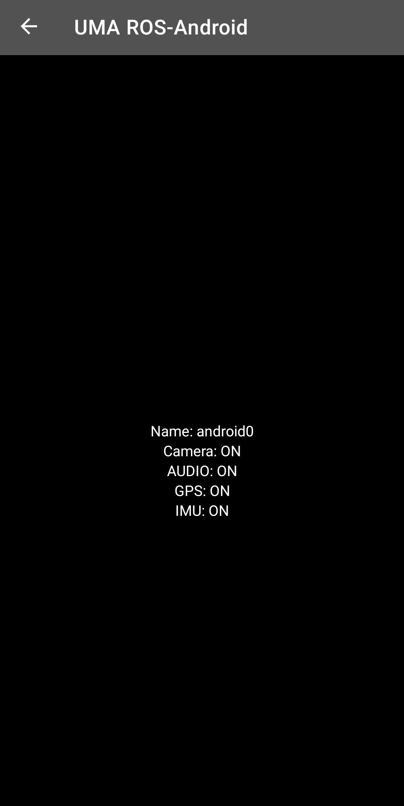

# UMA-ROS-Android
This app makes a smartphone able to publish data from its sensors to
other devices via ROS1 for monitoring purposes or to apply analysis algorithms based on Edge/Cloud Computing methods.

The target version of the app is Android 10 (properly tested), but should be compatible with versions greater than 5.0.

Current supported sensors are:
- Camera (using cameraX)
- Microphone (using AudioRecord)
- GPS (LocationManager)
- IMU (SensorManager)

The code of two latter are based in a previous solution called [android_sensors_driver](https://github.com/ros-android/android_sensors_driver),  
slightly modified for integration with the rest of the app.

Audio captured is published and also saved as a WAV file in the internal storage for offline analysis.

## Installation
The installation is made through Android Studio IDE. Since rosjava supports Gradle and Maven repositories, there's no
need for downloading any other dependencies manually. Everything will be automatically installed once you open and build the project
in Android Studio (Shift+F9).

To install the app, make sure that the desired SDK version is installed and run the app (Shift+F10), which will install it in your device.

## Configuration
The configuration screen to connect to the ROS network is based in the [default Master Chooser](https://github.com/rosjava/android_core/blob/kinetic/android_core_components/src/org/ros/android/MasterChooser.java) provided with rosjava. This version is a modified one where the commonly not used configuration parameters were scraped. Instead, now there are:

- A text entry for the IP address (local or public) and the LAN or WAN port of the ROS master to which the smartphone will connect 
- A text entry where the phone identifier is defined; 
- A series of switches to determine which sensory information is to be sent; 
- A button to start the connection.

This makes the execution of the app in multiple smartphones simultaneously in the same ROS network possible.

<p align="center">
    
<p/>

## Running
Once the connection with the ROS Master is established the Main Activity is executed, where all the nodes checked with the switches run and publish the data.
The GUI only shows information about the sensors running since our use case was the coupling of the smartphone to a robot, with no interaction from the user needed (other than configuration).

<p align="center">
    
<p/>

Topics in this case:
```
/android0/camera/compressed
/android0/camera/camera_info
/android0/audio
/android0/fix
/android0/IMU
```

Previous versions of the app showed a preview view of the camera in the Main Activity GUI but, due to battery consumption issues, it is currently removed. If needed it can be easily reimplemented thanks to cameraX.

## How to add more nodes

### Add a switch in the GUI

The procedure to add a new node is relatively simple and replicable. This step should be done iff you want to decide from the interface which nodes are executed. **However, in case you only want the node to be executed indefinitely, skip this section**

First, if you want to be able to choose from the GUI whether to activate the node, you must include a new switch in the configuration screen to do so:
- Go to project folder `<desired directory>/uma-ros-android/app/src/main/res/layout`. Here are the two interface files for the two activities included in the app. Open `activity_setup.xml`
- Locate the _container_ where all the switches are located and add a new one. It is recommended to copy one of the included ones and modify it to place it wherever you want (_Android Studio_ allows a preview to check that the interface is correct). For example:

```xml
<Switch
    android:id="@+id/NewSwitch"
    android:layout_width="100dp"
    android:layout_height="wrap_content"
    android:text="New"
    app:layout_constraintEnd_toEndOf="parent"
    app:layout_constraintStart_toEndOf="@+id/NLPSwitch"
    app:layout_constraintTop_toTopOf="parent"
    tools:ignore="UseSwitchCompatOrMaterialXml"
    android:textColor="@color/colorText" />
```

Next thing to do is to change the source code of the activities to know the state of the new switch:

- Go to the folder `.../app/src/main/java/com/example/umarosandroid`. In this folder is the source code for the two activities and the sensory management ROS nodes.

- Open the file `CustomMasterChooser.java`.

- Create a new variable called (following the previous example) `newSwitch` of type `Switch` and associate it to the switch defined in the _layout_. Also declare a `boolean` variable where the state of the switch will be store and a string for the transfer of variables between activities:

```java
public static final String ENABLE_NEW = "com.example.umarosandroid.ENABLE_NEW";
Switch newSwitch;
boolean enableNew;

newSwitch = (Switch) findViewById(R.id.NewSwitch);
```

- Add a new listener routine for the state of the new `Switch`:
```java
newSwitch.setOnCheckedChangeListener(new CompoundButton.OnCheckedChangeListener() {
@Override
public void onCheckedChanged(CompoundButton buttonView, boolean isChecked) {
enableNew = isChecked;
}
});
```

- Find the "Connect" button's listener routine and look for the conditional `if(result)`, which is true when a connection has been established with the ROS master. Add inside the following line, which will pass the state of the `Switch` (off or on) to the main activity to execute (or not) the corresponding node.
```java
mIntent.putExtra(ENABLE_NEW,enableNew);
```

The next step would be to modify the activity to launch the corresponding node based on the state of the switch when the button was pressed:
- Open the file `MainActivity.java`.

- Declare a variable of type `boolean` where the state of the switch is stored (in this activity), as well as its reception management from the configuration activity:

```java
boolean enableNew;
enableNew = intent.getBooleanExtra(CustomMasterChooser.ENABLE_NEW,false);
```

- Add in the execution routine `init(NodeMainExecutor nodeMainExecutor)` a conditional from the boolean variable for node execution.

```java
if(enableNew) {
    NewNode newNode = new NewNode(nodeName);
    nodeMainExecutor.execute(newNode, nodeConfiguration);
}
```

### No switch in the GUI 

In case the node doesn't need a switch, just:

- Open the file `MainActivity.java`.

- Add in the execution routine `init(NodeMainExecutor nodeMainExecutor)` the following lines:

```java
NewNode newNode = new NewNode(nodeName);
nodeMainExecutor.execute(newNode, nodeConfiguration);
```

### Define the node
Once the app is ready to execute the new ROS node, the last thing to do would be to write its source code.

- Create a `NewNode.java` class file

- Nodes in this application that are not based on the *android_sensors_driver* application (those created from scratch) follow the basic structure of [rosjava documentation](http://rosjava.github.io/rosjava_core/0.1.6/getting_started.html). That is, for example:

```java
public class NewNode extends AbstractNodeMain {
    private String nodeName;
    private Publisher<String> newPubliser;
    public NewNode(String nodeName) {
        this.nodeName = nodeName;
    }
    @Override
    public GraphName getDefaultNodeName() {
        return GraphName.of(nodeName+"/NewNode");
    }
    @Override
    public void onStart(ConnectedNode connectedNode) {
        newPubliser = connectedNode.newPublisher(nodeName+"/NewTopic",String._TYPE);
        String newMsg = newPubliser.newMessage();
        connectedNode.executeCancellableLoop(new CancellableLoop() {
            // Routine executed before
            // entering the main loop
            @Override
            protected void setup() {
                newMsg.setData("Hello World!");
            }
            // Main loop
            @Override
            protected void loop() throws InterruptedException {
                newPublisher.publish(newMsg);
                Thread.sleep(1000);
            }
        });
    }
}
```
- Note that it is also necessary to add the libraries, instances and other elements required for the new sensors or functionalities to be included, which are the responsibility of the reader to find the necessary documentation.

Finally, when the changes are loaded into the app, a ROS node called `<identifier>/NewNode` will be launched, this node will publish in the topic `/identifier/NewTopic` every second a message saying `"Hello World!"`. From this base structure we have created the rest of the more complex nodes such as the camera and audio nodes.
